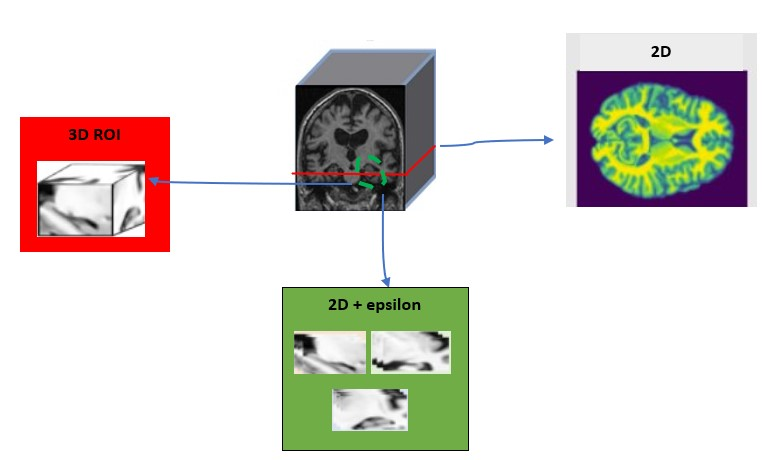
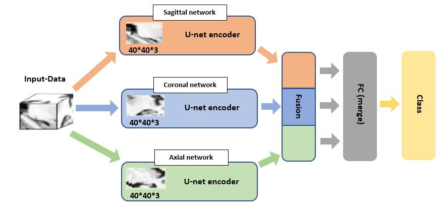
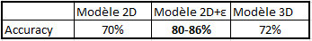

## Classification of sMRI images for Alzheimer Detection (2021)

### **Dataset**
- ADNI
### **Training Models/Strategies**
Only 2 class classification (AD/CN) is considered.
Three strategies of data selection were considered in this project they are represented by the image below.

Thus for each strategy we created a machine learning model, each of those models is based on the encoder part of the U-Net network.

 - 2D Model: Train a [U-net encoder + classification network] on 2D slices 
 
 - 2D + epsilon ROI Model: Fusion operation on three networks (Sagittal/Coronal/Axial) 
   
   
 - 3D ROI Model: Train a [U-net encoder + classification network] on a 3D patch of the hippocampus  
 - 
### **Result**  
- Comparison of different results:

